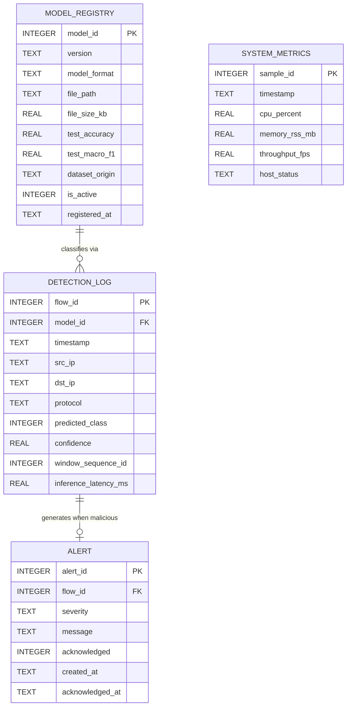

# Embedded Database Specification & Data Dictionary
## SQLite Relational Schema for Edge Intrusion Detection

**Document Identifier:** DB-SPEC-GRACE-2026-V1.0  
**Storage Engine:** SQLite 3 (Serverless, File-Based Embedded Database)  
**Database File:** `data/threat_detection.db`  
**Concurrency Configuration:** Write-Ahead Logging (`PRAGMA journal_mode=WAL;`)  
**Cross-Reference:** Chapter 3.12 of B.Sc. Project Report  

---

## 1. Concurrency Architecture & SQLite Tuning

Because the system employs a **decoupled process architecture**—where the edge inference worker continuously inserts detection events while the Flask web dashboard simultaneously queries records for browser clients—SQLite is tuned with high-performance embedded concurrency pragmas:

```sql
-- Enable Write-Ahead Logging to permit concurrent readers during active writes
PRAGMA journal_mode = WAL;

-- Synchronize buffers at checkpoints rather than every transaction for maximum throughput
PRAGMA synchronous = NORMAL;

-- Cache 10,000 pages in memory for fast lookup
PRAGMA cache_size = -10000;

-- Wait up to 5,000 milliseconds if another process holds a temporary write lock
PRAGMA busy_timeout = 5000;

-- Enforce foreign key constraints
PRAGMA foreign_keys = ON;
```

---

## 2. Entity-Relationship Diagram (ERD)



---

## 3. Detailed Data Dictionary

### 3.1 Table: `detection_log`
Records every classified 10-flow sequence window processed by the inference worker.

| Column Name | Data Type | Constraints | Description |
| :--- | :--- | :--- | :--- |
| `flow_id` | `INTEGER` | `PRIMARY KEY AUTOINCREMENT` | Unique identifier for each classification event. |
| `model_id` | `INTEGER` | `REFERENCES model_registry(model_id)` | Foreign key identifying the model version used. |
| `timestamp` | `TEXT` | `NOT NULL` | ISO 8601 UTC timestamp (`YYYY-MM-DDTHH:MM:SS.sssZ`). |
| `src_ip` | `TEXT` | `DEFAULT '192.168.1.100'` | Simulated source IP address of the traffic stream. |
| `dst_ip` | `TEXT` | `DEFAULT '192.168.1.1'` | Simulated destination IP address of the edge gateway. |
| `protocol` | `TEXT` | `DEFAULT 'TCP'` | Transport protocol (TCP, UDP, ICMP). |
| `predicted_class`| `INTEGER` | `NOT NULL CHECK (predicted_class IN (0, 1))` | 0 = Benign Traffic; 1 = Malicious Threat. |
| `confidence` | `REAL` | `NOT NULL CHECK (confidence BETWEEN 0.0 AND 1.0)`| Calibrated model prediction probability. |
| `window_sequence_id`| `INTEGER` | `NOT NULL` | Counter tracking the sequential 10-flow window. |
| `inference_latency_ms`| `REAL`| `NOT NULL` | High-precision inference duration in milliseconds. |

### 3.2 Table: `alert`
Stores security alerts raised whenever `predicted_class = 1` (Malicious Threat).

| Column Name | Data Type | Constraints | Description |
| :--- | :--- | :--- | :--- |
| `alert_id` | `INTEGER` | `PRIMARY KEY AUTOINCREMENT` | Unique alert identifier. |
| `flow_id` | `INTEGER` | `NOT NULL REFERENCES detection_log(flow_id)` | Foreign key referencing the triggering detection record. |
| `severity` | `TEXT` | `NOT NULL CHECK (severity IN ('LOW', 'MEDIUM', 'HIGH', 'CRITICAL'))` | Categorized threat severity based on confidence. |
| `message` | `TEXT` | `NOT NULL` | Human-readable security alert description. |
| `acknowledged` | `INTEGER` | `NOT NULL DEFAULT 0 CHECK (acknowledged IN (0, 1))`| 0 = Pending Review; 1 = Acknowledged by Operator. |
| `created_at` | `TEXT` | `NOT NULL` | Timestamp when alert was raised. |
| `acknowledged_at`| `TEXT` | `NULL` | Timestamp when operator acknowledged the alert. |

### 3.3 Table: `system_metrics`
Logs periodic hardware and performance samples captured via `psutil`.

| Column Name | Data Type | Constraints | Description |
| :--- | :--- | :--- | :--- |
| `sample_id` | `INTEGER` | `PRIMARY KEY AUTOINCREMENT` | Unique telemetry sample identifier. |
| `timestamp` | `TEXT` | `NOT NULL` | ISO 8601 UTC timestamp of sample collection. |
| `cpu_percent` | `REAL` | `NOT NULL` | CPU utilization percentage of the inference process. |
| `memory_rss_mb` | `REAL` | `NOT NULL` | Resident Set Size (RSS) physical memory in MB. |
| `throughput_fps`| `REAL` | `NOT NULL` | Instantaneous processing throughput (flows per second). |
| `host_status` | `TEXT` | `DEFAULT 'NORMAL'` | 'NORMAL', 'WARNING (>450MB)', or 'CRITICAL (>512MB)'. |

### 3.4 Table: `model_registry`
Tracks all trained and deployed model artifacts, hyperparameters, and test evaluations.

| Column Name | Data Type | Constraints | Description |
| :--- | :--- | :--- | :--- |
| `model_id` | `INTEGER` | `PRIMARY KEY AUTOINCREMENT` | Unique model entry identifier. |
| `version` | `TEXT` | `NOT NULL UNIQUE` | Semantic version string (e.g. `v1.0.0-unsw-hybrid`). |
| `model_format` | `TEXT` | `NOT NULL CHECK (model_format IN ('TFLITE', 'KERAS'))` | Serialization format. |
| `file_path` | `TEXT` | `NOT NULL` | Absolute or project-relative path to model binary. |
| `file_size_kb` | `REAL` | `NOT NULL` | Exact binary file size in kilobytes. |
| `test_accuracy` | `REAL` | `NOT NULL` | Held-out test accuracy (e.g. 0.9984). |
| `test_macro_f1` | `REAL` | `NOT NULL` | Held-out macro-averaged F1 score (e.g. 0.9982). |
| `dataset_origin`| `TEXT` | `NOT NULL` | 'UNSW-NB15' or 'CICIDS2017'. |
| `is_active` | `INTEGER` | `NOT NULL DEFAULT 0 CHECK (is_active IN (0, 1))` | 1 = Currently deployed in detection worker; 0 = Inactive. |
| `registered_at` | `TEXT` | `NOT NULL` | Timestamp of registration. |

---

## 4. DDL Execution Script

```sql
-- DDL Script: data/schema.sql

CREATE TABLE IF NOT EXISTS model_registry (
    model_id INTEGER PRIMARY KEY AUTOINCREMENT,
    version TEXT NOT NULL UNIQUE,
    model_format TEXT NOT NULL CHECK (model_format IN ('TFLITE', 'KERAS')),
    file_path TEXT NOT NULL,
    file_size_kb REAL NOT NULL,
    test_accuracy REAL NOT NULL,
    test_macro_f1 REAL NOT NULL,
    dataset_origin TEXT NOT NULL,
    is_active INTEGER NOT NULL DEFAULT 0 CHECK (is_active IN (0, 1)),
    registered_at TEXT NOT NULL
);

CREATE TABLE IF NOT EXISTS detection_log (
    flow_id INTEGER PRIMARY KEY AUTOINCREMENT,
    model_id INTEGER,
    timestamp TEXT NOT NULL,
    src_ip TEXT DEFAULT '192.168.1.100',
    dst_ip TEXT DEFAULT '192.168.1.1',
    protocol TEXT DEFAULT 'TCP',
    predicted_class INTEGER NOT NULL CHECK (predicted_class IN (0, 1)),
    confidence REAL NOT NULL CHECK (confidence BETWEEN 0.0 AND 1.0),
    window_sequence_id INTEGER NOT NULL,
    inference_latency_ms REAL NOT NULL,
    FOREIGN KEY (model_id) REFERENCES model_registry(model_id) ON DELETE SET NULL
);

CREATE TABLE IF NOT EXISTS alert (
    alert_id INTEGER PRIMARY KEY AUTOINCREMENT,
    flow_id INTEGER NOT NULL,
    severity TEXT NOT NULL CHECK (severity IN ('LOW', 'MEDIUM', 'HIGH', 'CRITICAL')),
    message TEXT NOT NULL,
    acknowledged INTEGER NOT NULL DEFAULT 0 CHECK (acknowledged IN (0, 1)),
    created_at TEXT NOT NULL,
    acknowledged_at TEXT,
    FOREIGN KEY (flow_id) REFERENCES detection_log(flow_id) ON DELETE CASCADE
);

CREATE TABLE IF NOT EXISTS system_metrics (
    sample_id INTEGER PRIMARY KEY AUTOINCREMENT,
    timestamp TEXT NOT NULL,
    cpu_percent REAL NOT NULL,
    memory_rss_mb REAL NOT NULL,
    throughput_fps REAL NOT NULL,
    host_status TEXT DEFAULT 'NORMAL'
);

-- Strategic Indexes for Sub-Millisecond Dashboard Queries
CREATE INDEX IF NOT EXISTS idx_detection_timestamp ON detection_log(timestamp DESC);
CREATE INDEX IF NOT EXISTS idx_detection_class ON detection_log(predicted_class);
CREATE INDEX IF NOT EXISTS idx_alert_acknowledged ON alert(acknowledged, created_at DESC);
CREATE INDEX IF NOT EXISTS idx_alert_severity ON alert(severity);
CREATE INDEX IF NOT EXISTS idx_metrics_timestamp ON system_metrics(timestamp DESC);
```
